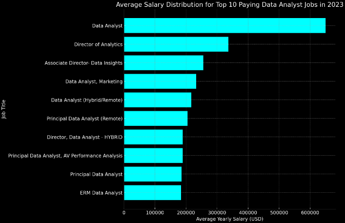
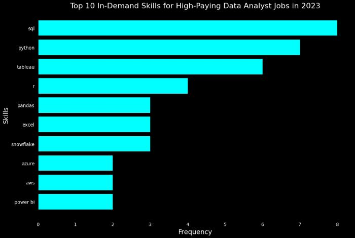

# Introduction 
Dive into the data job market! Focusing on data analyst roles, this project explores top paying jobs, in-demand skills, and where high demand meets high salary in data analytics.

SQL queries? Check them out here: [Project Job Analysis](./Project_Job_Analysis)

# Background
Driven by a quest to navigate the data analyst job market more effectively, this project was born from a desire to pinpoint top-paid and in-demand skills, streamlining others work to find optimal jobs.

### The questions I wanted to answer through my SQL queries were:

1. What are the top-paying data analyst jobs?
2. What skills are required for these top-paying jobs?
3. What skills are most in demand for data analysts?
4. Which skills are associated with higher salaries?
5. What are the most optimal skills to learn?

# Tools I used
For my deep dive into the data analyst job market, I harnessed the power of several key tools:
- **SQL:** The backbone of my analysis, allowing me to query the database and unearth critical insights.
- **PostegreSQL:** The chosen database management system, ideal for handling the job posting data.
- **Visual Studio Code:** My go-to for database management and executing SQL queries
- **Git & GitHub:** Essential for version control and sharing my SQL scripts and analysis, ensuring collaboration and project tracking

# The Analysis
Each query for this project aimed at investigating specific aspects of the data analyst job market.
Here's how I approached each question:

### 1. Top Paying Data Analyst Jobs
To identify the highest-paying roles, I filtered data analyst positions by average yearly salary and location, focusing on remote jobs. This query highlights the high paying opportunities in the field.

```sql
SELECT
    job_id,
    job_title,
    job_location,
    job_schedule_type,
    salary_year_avg,
    job_posted_date,
    name as company_name
from 
    job_postings_fact
left JOIN company_dim ON job_postings_fact.company_id = company_dim.company_id
where job_title_short = 'Data Analyst' 
and job_location = 'Anywhere'
and salary_year_avg is not null
order BY salary_year_avg DESC
limit 10;
```

Here is the breakdown of the top data analyst jobs in 2023:
- **Wide Salary Range:** Top 10 paying data analyst jobs span from $184,000 to $650,000, indicating significant salary potential in the field.
- **Diverse Employers:** Companies like SmartAssets, Meta and AT$T are among those offering high salaries
- **Job Title Variety:** There is a high diversity in job titles, from Data Analyst to Director of Analytics, reflecting varied roles and specializations within data analytics.



*Bar graph visualizing the salary for the top 10 salaries for data analysts; ChatGPT generated this graph from my SQL query results*


### 2. Top Paying Data Analyst Job Skills

To identify what skills are required for highest-paying roles, I joined the job postings with the skills data, providing insights into what employers value for high-compensation roles

```sql
with top_paying_jobs as (

SELECT
    job_id,
    job_title,
    salary_year_avg,
    name as company_name
from 
    job_postings_fact
left JOIN company_dim ON job_postings_fact.company_id = company_dim.company_id
where job_title_short = 'Data Analyst' 
and job_location = 'Anywhere'
and salary_year_avg is not null
order BY salary_year_avg DESC
limit 10
)

select 
    top_paying_jobs.*,
    skills
from top_paying_jobs
INNER JOIN skills_job_dim on top_paying_jobs.job_id = skills_job_dim.job_id
INNER JOIN skills_dim on skills_job_dim.skill_id = skills_dim.skill_id
ORDER BY salary_year_avg DESC;
```

Here is the breakdown of the most demanded skills for the top highest paying data analyst jobs in 2023:

Here is the the breakdown of the most demanded skills for data analyst jobs in 2023, based on job postings:
- SQL is leading with a count of 8
- Python is a count of 7
- Tableau is count of 6
- other skills like R, Snowflake, Pandas and Excel shows varying degrees of demand



*Bar graph visualizing the count of skills for the top 10 paying jobs for data analysis; ChatGPT generated this graph from my SQL query results*

### 3. In-demand skills for Data Analysts
This query helped me identify the skills most fequently requested in job postings, directing focus to areas with high demand skills

```sql
SELECT 
    skills,
    count(skills_job_dim.job_id) as demand_count
from job_postings_fact
INNER JOIN skills_job_dim on job_postings_fact.job_id = skills_job_dim.job_id
INNER JOIN skills_dim on skills_job_dim.skill_id = skills_dim.skill_id
WHERE job_title_short = 'Data Analyst'
AND job_work_from_home = TRUE
group by skills
order by demand_count DESC
LIMIT 5;
```
Here is the breakdown of the most in demand skills for data analysts in 2023:

- **SQL** and **Excel** remain fundamental, emphasizing the need for strong foundational dkills in data processing and spreadsheet manipulation
- **Programming** and **Visualization Tools** like **Python**, **Tableau** and **Power BI** are essential, pointing towards the increasing importance of technical skills in data storytelling and decision support.

|  Skills  | Demand Count |
|----------|--------------|
| SQL      | 7291         |
| Excel    | 4611         |
| Python   | 4330         |
| Tableau  | 3745         |
| Power BI | 2609         |

*Table of demand for the top 5 skills in data analyst jobs*

### 4. Skills based on Salary
Exploreing the average salaries associated with different skills revealed which skills are the highest paying.

```sql
SELECT 
    skills,
    round(avg(salary_year_avg),2) as avg_salary
from job_postings_fact
INNER JOIN skills_job_dim on job_postings_fact.job_id = skills_job_dim.job_id
INNER JOIN skills_dim on skills_job_dim.skill_id = skills_dim.skill_id
WHERE job_title_short = 'Data Analyst'
AND salary_year_avg is NOT NULL
AND job_work_from_home = TRUE
group by skills
order by avg_salary DESC
LIMIT 25;
```
Here is a breakdown of the results for top paying skills for Data Analysts:

- High demand for **Big Data** and **ML Skills:** Top salaries are commanded by analysts skilled in big data technologies (PySpark, Couchbase), mashine learning tools (DataRobot, Jupyter) and Python libraries (Pandas, Numpy)
- **Software development & Software Proficiency:** Knowledge in development and deployment tools (GitLab, Kubernetes, Airflow)
- **Cloud computing Expertise:** Familiarity with cloud and data engineering tools (Elasticsearch, Databricks, GCP)


|    Skills    | Average Salary ($) |
|--------------|--------------------|
| pyspark      | 208,172            |
| bitbucket    | 189,155            |
| couchbase    | 160,515            |
| watson       | 160,515            |
| datarobot    | 155,486            |
| gitlab       | 154,500            | 
| swift        | 153,750            |
| jupyter      | 152,777            |
| pandas       | 151,821            |
| elsticsearch | 145,000            |

*Table of the average salary for the top 10 paying skills for data analysts* 

### 5. Most Optimal Skills to Learn

Combining insights from demand and salary data, this query aimed to pinpoint skills that are both in high demand and have high salaries, offering a strategic focus for skill development.

```sql
WITH skills_demand as
(
SELECT 
    skills_dim.skill_id,
    skills_dim.skills,
    count(skills_job_dim.job_id) as demand_count
from job_postings_fact
INNER JOIN skills_job_dim on job_postings_fact.job_id = skills_job_dim.job_id
INNER JOIN skills_dim on skills_job_dim.skill_id = skills_dim.skill_id
WHERE job_title_short = 'Data Analyst'
AND salary_year_avg is NOT NULL
AND job_work_from_home = TRUE
group by skills_dim.skill_id
),

average_salary AS(
SELECT 
    skills_job_dim.skill_id,
    round(avg(salary_year_avg),2) as avg_salary
from job_postings_fact
INNER JOIN skills_job_dim on job_postings_fact.job_id = skills_job_dim.job_id
INNER JOIN skills_dim on skills_job_dim.skill_id = skills_dim.skill_id
WHERE job_title_short = 'Data Analyst'
AND salary_year_avg is NOT NULL
AND job_work_from_home = TRUE
group by skills_job_dim.skill_id
)

SELECT
    skills_demand.skill_id,
    skills_demand.skills,
    demand_count,
    avg_salary
from
    skills_demand
INNER JOIN average_salary on skills_demand.skill_id = average_salary.skill_id
WHERE
    demand_count > 10
ORDER BY 
    avg_salary DESC,
    demand_count DESC
    LIMIT 25;
```

|  Skill ID  |  Skills    |  Demand Count  | Average Salary ($) |
|------------|------------|----------------|--------------------|
| 8          |   go       |   27           |  115,320           |
| 234        | confluence |   11           |  114,210           |
| 97         | hadoop     |   22           |  113,193           |
| 80         | snowflake  |   37           |  112,948           |
| 74         | azure      |   34           |  111,225           |
| 77         | bigquery   |   13           |  109,654           |
| 76         | aws        |   32           |  108,318           |
| 4          | java       |   17           |  106,906           |
| 194        | ssis       |   12           |  106,683           |
| 233        | jira       |   20           |  104,918           |

*Table of the most optimal skills for data analyst sorted by salary*

Here is a breakdown of the most optimal skills for Data Analysts in 2023:

- **High-demand Programming Languages:** Python and R stand out for their high demand, with demand counts of 236 and 148 respectively. Despite their high demand, their average salaries are around $101,397 for Python and $100,499 for R, indicating that proficiency in these languages is highly valued but also widely available.
- **Cloud Tools and Technologies:** Skills in specialized technologies such as Snowflake, Azure, AWS and BigQuery show significant demand with relatively high average salaries
- **Business Intelligence and Visualization Tools:** Tableaus and Looker, with demand count of 230 and 49 respectively, and average salaries around $99,288 and $103,795
- **Database Technologies:** The demand for skills in traditional and NoSQL databases (Oracle, SQL Server, NoSQL) with average salaries ranging from $97,786 to $104,534 reflects the enduring need for data storage, retrieval and management expertise.

# Conclusion

### Insights
From the analysis, several general insights emerged:

1. **Top Paying Data Analyst Jobs:** The highest-paying jobs for data analysts that allow remote work offer a wide range of salaries, the highest at $650,000!
2. **Skills for Top-Paying Jobs:** High-paying data analyst jobs require advanced proficiency in SQL, suggesting it is a critical skill for earning a top salary.
3. **Most In-Demand Skills:** SQL is also the most demanded skill in the data analyst job market, thus making it essencial for job seekers.
4. **Skills with Higher salaries:** Specialized skills, such as SVN or Solidity, are associated with the highest average salaries.
5. **Optimal Skills for Job Market Value:** SQL leads in demand and offers for a high average salary, positioning it as one of the most optimal skills for data analysts.

### Closing Thoughts
This project enhanced my SQL skills and provided valuable insights into the data analyst job market. The findings from the analysis serve as a guide to prioritizing skill development and job search efforts. Aspiring data analysts can better position themselves in a competitive job market by focusing on high-demand, high-salary skills.
